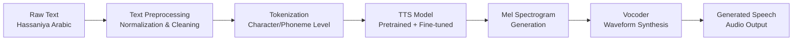
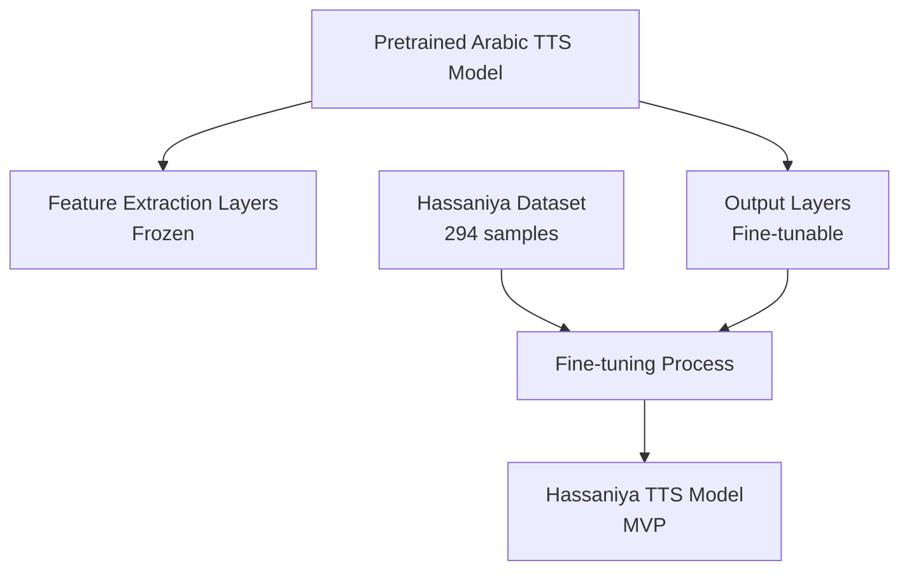

# Hassaniya Arabic Text-To-Speech System Using Transfer Learning

<div align="center">

**Development of a Hassaniya Dialect Speech Synthesis System**

*Master M1 — Artificial Intelligence*
*Module: NLP Dialects*

**Mohamed Salem Ebnou Echvagha Oubeid** | ID: C34613

June 2026

</div>

---

## Overview

This project presents a **proof-of-concept Text-To-Speech (TTS) system** for the **Hassaniya Arabic dialect** — the primary Arabic dialect spoken in Mauritania and parts of Western Sahara, Mali, and Senegal.

Hassaniya is a **low-resource dialect** with very limited digital presence and almost no existing speech synthesis tools. This project explores the feasibility of building a TTS pipeline using **transfer learning** from pretrained Arabic TTS models, rather than training from scratch.

## Objectives

- Build an end-to-end TTS pipeline for Hassaniya Arabic
- Demonstrate transfer learning from pretrained Arabic speech models
- Create a reusable preprocessing and annotation pipeline
- Document challenges of working with low-resource dialects
- Provide a foundation for future Hassaniya speech technology research

## Dataset

| Property | Value |
|----------|-------|
| **Samples** | 294 audio recordings |
| **Format** | Audio bytes + text transcriptions |
| **Language** | Hassaniya Arabic (Mauritanian dialect) |
| **Avg. text length** | ~33 characters |
| **Source** | Collected Hassaniya speech samples |

## Methodology

### Pipeline Architecture



### Transfer Learning Strategy



### Text Preprocessing Pipeline


## Project Structure

```
hassaniya-tts/
│
├── data/
│   ├── raw/                    # Raw extracted audio files
│   ├── processed/              # Preprocessed audio files
│   └── metadata.csv            # Text-audio mappings
│
├── notebooks/
│   ├── 01_data_exploration.ipynb    # Dataset analysis & visualization
│   ├── 02_annotation.ipynb          # Text normalization & phoneme mapping
│   ├── 03_preprocessing.ipynb       # Audio processing & feature extraction
│   └── 04_tts_demo.ipynb            # TTS pipeline demonstration
│
├── src/
│   ├── __init__.py
│   ├── preprocessing.py        # Text preprocessing utilities
│   ├── audio_utils.py          # Audio processing functions
│   └── config.py               # Project configuration
│
├── reports/
│   └── report.tex              # Complete LaTeX report
│
├── presentation/
│   └── index.html              # HTML/CSS/JS presentation slides
│
├── results/
│   ├── spectrograms/           # Generated mel spectrograms
│   ├── generated_audio/        # Synthesized speech samples
│   └── figures/                # Plots and visualizations
│
├── audios_dataset.parquet      # Original dataset
├── requirements.txt            # Python dependencies
├── CLAUDE.md                   # Project documentation
├── phases.md                   # Execution plan
├── README.md                   # This file
└── LICENSE                     # MIT License
```

## Installation

```bash
# Clone the repository
git clone https://github.com/Muhammed-OTP/Hassaniya-Arabic-Text-To-Speech-System-Using-Transfer-Learning.git
cd Hassaniya-Arabic-Text-To-Speech-System-Using-Transfer-Learning

# Install dependencies
pip install -r requirements.txt
```

## Usage

### Run Notebooks (Recommended: Google Colab)

1. **Data Exploration**: Open `notebooks/01_data_exploration.ipynb`
2. **Annotation**: Open `notebooks/02_annotation.ipynb`
3. **Preprocessing**: Open `notebooks/03_preprocessing.ipynb`
4. **TTS Demo**: Open `notebooks/04_tts_demo.ipynb`

### Quick Start

```python
from src.preprocessing import HassaniyaTextProcessor

processor = HassaniyaTextProcessor()
cleaned = processor.normalize("السلام عليكم ورحمة الله")
tokens = processor.tokenize(cleaned)
```

## Results

This project is a **proof of concept**. Key findings:

- Successfully built an end-to-end preprocessing pipeline for Hassaniya text
- Demonstrated feasibility of transfer learning for low-resource dialect TTS
- Identified key challenges: limited data, dialect-specific phonology, diacritics handling
- Generated preliminary spectrograms and audio samples

> **Note**: With only 294 samples, the model produces approximate results. Production-quality TTS would require 5,000–10,000+ hours of recorded speech.

## Challenges & Limitations

- **Small dataset**: 294 samples is far below the typical requirement for TTS training
- **No standardized orthography**: Hassaniya lacks consistent written conventions
- **Limited pretrained models**: Few Arabic TTS models exist, none for Hassaniya specifically
- **Compute constraints**: Fine-tuning was performed with limited GPU resources

## Future Work

- Expand dataset to 5,000+ annotated recordings
- Develop Hassaniya-specific phoneme inventory
- Train dedicated Tacotron2/VITS model with larger dataset
- Build web-based demo application
- Collaborate with Mauritanian linguists for phonological validation
- Explore multi-speaker TTS for dialect variation

## Tech Stack

| Tool | Purpose |
|------|---------|
| Python 3.10+ | Core language |
| PyTorch | Deep learning framework |
| Librosa | Audio analysis |
| Matplotlib/Seaborn | Visualization |
| Pandas/NumPy | Data processing |
| gTTS / Coqui TTS | TTS engine |
| Google Colab | Training environment |
| LaTeX | Academic report |

## References

1. Wang, Y. et al. (2017). "Tacotron: Towards End-to-End Speech Synthesis." *INTERSPEECH*.
2. Shen, J. et al. (2018). "Natural TTS Synthesis by Conditioning WaveNet on Mel Spectrogram Predictions." *ICASSP*.
3. Kim, J. et al. (2021). "Conditional Variational Autoencoder with Adversarial Learning for End-to-End Text-to-Speech." *ICML*.
4. Casanova, E. et al. (2022). "YourTTS: Towards Zero-Shot Multi-Speaker TTS and Zero-Shot Voice Conversion for Everyone." *ICML*.
5. Xu, L. et al. (2020). "LRSpeech: Extremely Low-Resource Speech Synthesis and Recognition." *KDD*.

## License

This project is licensed under the MIT License — see [LICENSE](LICENSE) for details.

---

<div align="center">
<i>Master M1 AI — NLP Dialects Module — June 2026</i>
</div>
